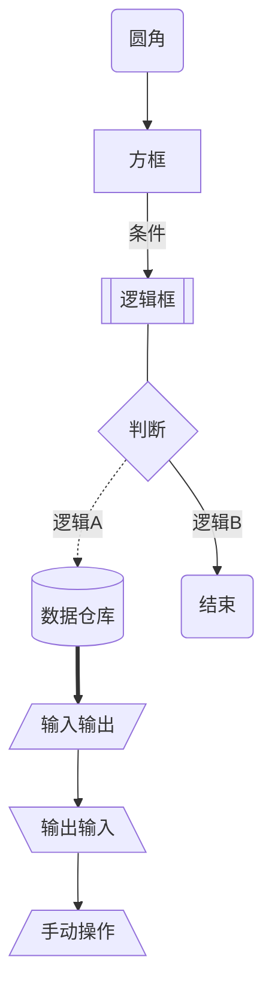

# markdown流程图语法

https://mermaid-js.github.io/mermaid/#/flowchart

```mermaid
graph TD 
Begin(圆角)-->A[方框]-->|条件|C[[逻辑框]]
C --- D{判断}
D -.-> |逻辑A|E[(数据仓库)]
D --> |逻辑B|End(结束)
E ==> F[/输入输出/]
F--> G[\输出输入\]
G -->H[/手动操作\]

```